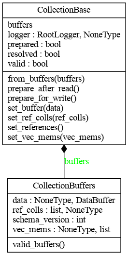
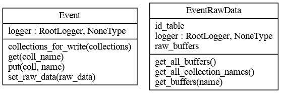
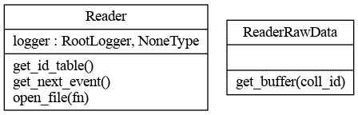
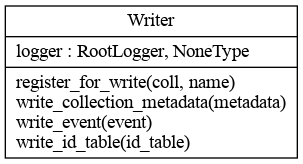
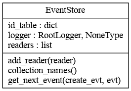

# Redesign of the I/O part of podio

This folder contains a python prototype implementation of the I/O system that
should be able to fulfill the [requirements](#requirements) that we have for the
new I/O system. It needs python3 to run, and uses type annotations to somewhat
emulate the c++ type system. Use

```sh
mypy podio # for the core components
mypy *.py  # for the applications
```

to check the consistency of the type annotations (assuming that all annotations
are correct).

The current implementation does nothing useful! It basically just logs function
calls and passes some "random" data around that should resemble the real world
use cases and assumptions. It also glances over a lot of details, especially for
the [schema evolution implementation](#schema-evolution), only a possible way of
applying it is presented and the generation and loading of the functionality is
completely ignored. The chosen [abstractions](#datatypes-used-in-the-prototype)
aim to capture the essentials of the real world use cases. There are still a
[few things that are not yet addressed](#open-questions), but these are
potentially outside of the scope of what podio should be able to handle.

## Examples
This directory contains two examples

### Single threaded
`single_thread.py` presents a single threaded application that supports
- Reading from a root and an sio reader (or just one of the two)
- Using **either** lazily unpacking Events or eagerly unpacing Events
- Re-using Event slots instead of crating new Events
- (Optionally) writing to a root and/or an sio writer

To run it at least one type of reader has to be specified, all other arguments
are optional. Apart from the mutually exlcusive `--lazy-event` and
`--eager-event` all can be used simultaneously to see the prototype in its full
glory.

All options:
```
usage: single_thread.py [-h] [--sio-reader] [--root-reader] [--sio-writer] [--root-writer] [-n NEVENTS] [--lazy-event | --eager-event] [--reuse]

Small main program that exhibits the possibilities of the prototype

optional arguments:
  -h, --help            show this help message and exit
  --sio-reader          Add an SIO example reader
  --root-reader         Add a ROOT example reader
  --sio-writer          Add an SIO example writer
  --root-writer         Add an ROOT example writer
  -n NEVENTS, --nevents NEVENTS
                        How many events to run
  --lazy-event          Choose the lazy event
  --eager-event         Choose the eager event
  --reuse               Re-use the events instead of creating them from scratch for every event
```

### Multi threaded
`multi_thread.py` presents a multi threaded application that supports
- Reading from a root and an sio reader (or just one of the two)
- Using **either** lazily unpacking Events or eagerly unpacing Events

The multi threaded prototype does not (yet?) support writing or re-usage of
event slots since that would require quite a bit of management code that is not
strictly in the scope of podios I/O capabilities. Furthermore the threading is
only emulated via pythons `multiprocessing.dummy`. The main purpose of this
example is to show that an Event can live on its own in a thread decoupled from
the readers and the input system after it has been created and filled with data.

To run it at least one type of reader has to be specified, all other arguments
are optional. Apart from the mutually exlcusive `--lazy-event` and
`--eager-event` all can be used simultaneously.

All options:
```
usage: multi_thread.py [-h] [--sio-reader] [--root-reader] [-n NEVENTS] [-t THREADS] [--lazy-event | --eager-event]

Small main program that exhibits the possibilities of the prototype

optional arguments:
  -h, --help            show this help message and exit
  --sio-reader          Add an SIO example reader
  --root-reader         Add a ROOT example reader
  -n NEVENTS, --nevents NEVENTS
                        How many events to run
  -t THREADS, --threads THREADS
                        How many threads to use
  --lazy-event          Choose the lazy event
  --eager-event         Choose the eager event
```

## Requirements
This is (a probably incomplete) list of the requirements that should be
supported
- Read from multiple readers simultaneously
  - Readers can provide different data formats
- Data read from files written with an older schema version of the EDM than the
  current one needs to be evolved to the current schema before the first user
  access to it (i.e. the user only always sees the latest schema)
- Use multiple writers to write multiple different output files
  - Writers can write different data formats
  - Writers can write different subsets of the total content
- Between reading and writing the data "belonging" to one Event should be
  accessible in a thread-safe way
- It should be possible to defer the "unpacking" of Event data as long as
  possible until it is actually needed
- It should still be possible to have the "unpacking" as early as possible (but
  probably only once the data has left the reader thread)
- Reading and writing should be possible asynchronously to the rest of the event
  processing
  
All of these things should be possible with the current implementation, but in
order to not completely overload the application examples not all of them are
actively used (e.g. while only a subset of the available collections is written,
it is the same subset for both writers, even though it would be possible to
change this).

## Basic design
### Input system
The current implementation of the input system looks like this:


The `EventStore` serves as managing entity for several readers that can provide
(more or less) arbitrary data and combines these `ReaderRawData` into
`EventRawData` from which `Events` can be constructed (or construct themselves).

## Datatypes used in the prototype

### `CollectionBase`
Should resemble `podio::CollectionBase` on a very basic level, but is really
just a more or less empty container that keeps track of some state to indicate
which operations have already happened (e.g. `prepared` to indicate that a
`prepare_for_write` has been called).

Defined in [podio/collection.py](podio/collection.py)

### `CollectionBuffers`
Helpfull container class to encapsulate all the "raw data buffers" from which a
collection can be constructed. Also holds the `schema_version` of these raw data
buffers. This is essentially what a reader needs to be able to produce and what
a writer needs to be able to handle for writing. In the toy implementation here
the `DataBuffer`, `RefCollBuffer` and `VecMemBuffer` are just small type
annotated helper classes, but their actual types are not really interesting for
this prototype.

Defined in [podio/collection.py](podio/collection.py)



### `Event`
Base class to define the interface of the `Event` class. Very basic in this
prototype. Only provides access to stored collections via `get` and allows to
store new collections via `put`. Also has `collections_for_write` to retrieve
the desired collections for writing. In this call the `Event` has to take care
of calling `prepare_for_write` for all collections that are requested. To allow
for a "slot type" re-usage the `Event` can either take
[`EventRawData`](#eventrawdata) in its constructor or it can be set at a later
stage via `set_raw_data`.

Defined in [podio/event.py](podio/event.py). Implemented by
[`LazyEvent`](#lazyevent) and [`EagerEvent`](#eagerevent).

### `EventRawData`
Another useful container type that holds all the "raw" data that is necessary to
build an actual `Event` from it. Currently holds a list of
[`ReaderRawData`](#readerrawdata) objects and also an `id_table` that is able to
identify from which `ReaderRawData` the `CollectionBuffers` to construct a given
collection can be obtained. Offers two main functions:
- `get_buffer` to get the `CollectionBuffers` and some type information for a
  single collection
- `get_all_buffers` to get the names and `CollectionBuffers` as well as some
  type information for all collections (from all available raw data).

Defined in [podio/event.py](podio/event.py)



### `Reader`
Base class to define the interface of the `Reader` class. Main function is
`get_next_event` that returns a `ReaderRawData` object.

Defined in [podio/reader.py](podio/reader.py). Implemented by
[`SioReader`](#sioreader-and-siorawdata) and
[`RootReader`](#rootreader-and-rootrawdata).

### `ReaderRawData`
Base class to define a common interface for the arbitrary data that different
`Reader`s return. Only defines one function: `get_buffer` that takes a
collection index (or other identifier) and that has to return a
`CollectionBuffer` as well as some type information. Owns the raw data, but does
not own the buffers it returns from `get_buffer`.

Defined in [podio/reader.py](podio/reader.py). Implemented by
[`SioRawData`](#sioreader-and-siorawdata) and
[`RootRawData`](#rootreader-and-rootrawdata).



### `Writer`
Base class to define the interface of the `Writer` class. Offers functionality
to write any `Event` as well as some auxiliary functions that are necessary to
store "metadata" (in the widest sense), e.g. the collection id table.

Defined in [podio/writer.py](podio/writer.py) and implemented by
[`SioWriter`](#siowriter) and [`RootWriter`](#rootwriter).



### `EventStore`
The main access point to get events from readers. Manages several readers and
upon request returns the next `Event` via `get_next_event` that takes as
required argument a `create_evt` function that tells it how to create the event
(can be used to customize which type of event). The `create_evt` function should
be able to take an optional `Event` as argument for re-usage. This `Event` has
to be passed as second argument to `get_next_event` in case slot re-usage is
desired.

In general this class is a helper class that takes over some of the framework
responsibilty in this simply prototype.

Defined in [podio/event_store.py](podio/event_store.py).



## Concrete implementations of base classes

Here are some concrete implementations of the base classes that are used in
`single_thread.py` and `multi_thread.py`. They skip over a lot of details, e.g.
`TTree` handling or `SioBlock` and other type handling is completely absent and
replaced by very simple functionality that takes these things more or less as
given or generates the necessary data "from thin air".

### `SioReader` and `SioRawData`
`Reader` class and `ReaderRawData` implementation for sio. Very simplified
picture of what happens when reading events via sio. The `SioRawData` take an
`SioCompressedEvent` and some type information for all the collections in the
compressed events as constructor arguments. On the first call to
`SioRawData.get_buffer` the compressed event is inflated, and the compressed
data is discarded. From the uncompressed `SioBlocks` it is now possible to easily
get the corresponding `CollectionBuffers`.

Defined in [podio/sio_reader.py](podio/sio_reader.py).

### `RootReader` and `RootRawData`
`Reader` class and `ReaderRawData` implementation for root. Very simplified
picture of what is happening when reading events via root. The `RootRawData` is
essentially just a collection of `RootRawBuffers`, which are already pretty
close to the actual `CollectionBuffers`. The type information that is passed in
the constructor is probably not strictly necessary for root to correctly unpack
buffers, but it is necessary as input to the schema evolution.

Defined in [podio/root_reader.py](podio/root_reader.py).

### `LazyEvent`
`Event` class that lazily unpacks the collections only when they are actually
requested. Once a collection has been unpacked it is cached internally. In
`collections_for_write` also has to check for collections that have not yet been
unpacked in case they are requested for write. In the current implementation
these are unpacked and schema evolved to make sure that the written collections
all have the same schema.

Defined in [podio/lazy_event.py](podio/lazy_event.py).

### `EagerEvent`
`Event` class that eagerly unpacks all collections on the first call to `get`
(and after unpacking immediately discards of the raw data). The reason to have
the unpacking being only triggered by `get` is because it was the easiest way to
not have this happen in the constructor, resp. in the `set_raw_data`, because
these calls potentially happen on the "reader thread" and we would definitely
like to have the unpacking happen on an "event thread".

Defined in [podio/eager_event.py](podio/eager_event.py).

### `SioWriter`
Implementation of the `Writer` class for the sio backend. Simply collects all
collection buffers before compressing them and writing them. **NOTE:** Doesn't
strictly need the `register_for_write` because sio could in principle write
arbitrary events. However, it makes the handling of type information on the
reading end much easier if there is a pre-defined event content.

Defined in [podio/sio_writer.py](podio/sio_writer.py).

### `RootWriter`
 `Writer` implementation for the root backend. Very little logic in here because
that goes mostly into the branch handling in reality which we completely omit here.

Defined in
[podio/root_writer.py](podio/root_writer.py).

## Schema evolution
The schema evolution is very preliminary. It operates on the following assumptions
- The EDM has a global schema version and this version does not change inside a
  given file. Individual datatypes cannot have differing schema versions.
- There is a way to generate the necessary evolution functionality for all
  datatypes in the EDM from **older** schema versions to the current schema
  version.
  - This evolution functionality takes as input a `CollectionBuffers` and
    returns a `CollectionBuffers` where the `DataBuffer` of all collection
    elements are now of the current schema version.
  - If it is easier to generate the evolution functionality for only one element
    this should not be a big problem.
- There is a way to load this evolution functionality in such a way that there
  is some sort of lookup table that contains all datatypes and furthermore all
  **start** (i.e. read) schema versions for which such an evolution is necessary
  and available. If no such functionality is available **it is assumed that no
  evolution is necessary**.
- Taking all this together, the schema evolution facility needs as inputs the
  datatype and the `CollectionBuffers` that have been read in. (The
  `CollectionBuffers` contain their schema version).

Most of this is assumed to be given and the current schema evolution simply
defines a few global variables that represent this functionality. The entry
point is the `evolve_schema` function in
[podio/schema_evolution.py](podio/schema_evolution.py). This function is called
in the `Event` classes described above right after a `CollectionBuffer` has been
unpacked from the `ReaderRawData`. (See e.g. the `_try_unpack` function in
`EagerEvent` or the `get` and `collections_for_write` functions in `LazyEvent`).

## Open questions
This is a (again probably incomplete) list of open questions or points that I
have stumbled over during the implementation:
- Details of schema evolution
- How to actually handle multiple readers properly
  - Presumably each reader has a "local" collection ID table, that would need to
    be re-mapped to a "global" one for proper intra-event and inter-reader
    relation handling. This re-mapping has to be kept available, because when
    accessing the `ReaderRawData` that only has access to its "local" collection
    id table.
  - What happens if the "same" collection (by name) is present in more than one
    reader?
  - Do we want to actually handle relations across file boundaries?
  - How do we make sure that the collection id mapping stays valid on file
    changes, where potentially also the "local" (and thus by definition) the
    "global" table changes? This could be achieved by having a `shared_ptr`
    access to this collection table for each `EventRawData` (in the current
    implementation), but the **hard part is actually the update mechanism of the
    global table**, because currently there is no communication from the readers
    to the `EventStore`. Potentially the latter could query the readers before
    each event?
  - How do we merge multiple sources of metadata (which are again potentially
    conflicting). Similar concerns on file change as for event data.
- Handling of non present collections when writing
  - Presumably mainly a framwork concern where we want to filter the output, so
    could be shifted to framework, since there this needs to be done in any case
    for scheduling.
- Handling of only being able to put collections into an `Event` if it is also
  possible to write the collection?
  - Do we need to worry about this, or can we simply assume that these are
    transient?
- Metadata handling. This concerns mainly run and collection metadata in my
  opinion. What we usually refer to as "event metadata" is better described as
  "generic data" which we can probably handle similar to collections at least as
  far as I/O goes.
  - For run and metadata we probably only need read functionality from an Event,
    as it should be written either during initialization or during a run change,
    both of which happen outside the usual event loop.
  - What is really left for event metadata if we have "generic parameters"
    support?

### Things considered "trivial enough" to omit them in the prototype
- Checking if a collection is already present when putting it into an `Event`
  - Only need to decide what happens in such a case (hard or soft failure?)
- Implementation of run and collection meta data **writing**
  - Currently only assume that we need to be able to write some sort of "mapping
    data" (i.e. almost but not completely arbitrary).
  - The actual implementation for handling it in general is a completely
    different beast.
- The actual implementation of the "type information" transport. Currently it is
  string based, but this can potentially be made more efficient in reality
